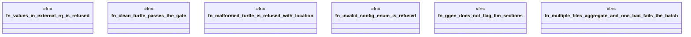

# `crates/ggen-lsp/tests/headless_gate_test.rs`

Source SHA-256: `6f39c84671dd2360ca3ef71e19080bc023b21257a590fd4640d84ad3b3f23e30`

## Dependencies

- `ggen_lsp::check_files`
- `std::fs`
- `tempfile::TempDir`

## Standing

- Structural parse: `ALIVE`
- Runtime behavior: `UNKNOWN`
