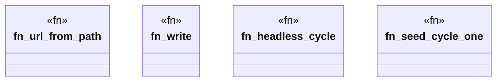

# `crates/ggen-lsp/tests/improve_result_test.rs`

Source SHA-256: `06c8040e8916a3fddd2c248d7e234b58d1156cc352b7b14c040d2aa01bf29049`

## Dependencies

- `ggen_lsp::intel::MetricValue`
- `ggen_lsp::state::ServerState`
- `ggen_lsp::{check_files_in_root, compute_metrics, mine}`
- `lsp_max::lsp_types::Url`
- `std::fs`
- `std::path::{Path, PathBuf}`
- `tempfile::TempDir`

## Standing

- Structural parse: `ALIVE`
- Runtime behavior: `UNKNOWN`
