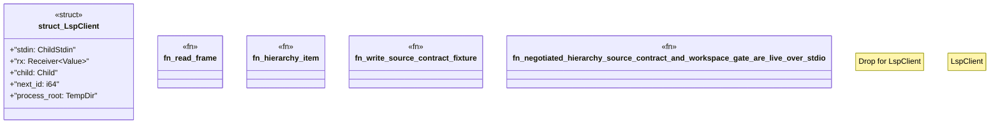

# `crates/ggen-lsp/tests/lsp_contract_completion_test.rs`

Source SHA-256: `ef5db7cd8813d8127ddd939504d01b28426f23ed9a92404d70784b5af4dcb0bd`

## Dependencies

- `serde_json::{json, Value}`
- `std::io::{BufRead, BufReader, Read, Write}`
- `std::process::{Child, ChildStdin, Command, Stdio}`
- `std::sync::mpsc::{self, Receiver}`
- `std::thread`
- `std::time::Duration`
- `tempfile::TempDir`

## Standing

- Structural parse: `ALIVE`
- Runtime behavior: `UNKNOWN`
