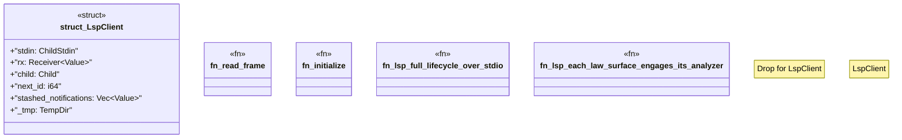

# `crates/ggen-lsp/tests/lsp_protocol_test.rs`

Source SHA-256: `9ae4dcbbcb2aedfc51fc7462f37372a4bc515f3b9dc41b89f20528072fb510a2`

## Dependencies

- `serde_json::{json, Value}`
- `std::io::{BufRead, BufReader, Read, Write}`
- `std::process::{Child, ChildStdin, Command, Stdio}`
- `std::sync::mpsc::{self, Receiver}`
- `std::thread`
- `std::time::Duration`
- `tempfile::TempDir`

## Standing

- Structural parse: `ALIVE`
- Runtime behavior: `UNKNOWN`
