# `crates/ggen-lsp/tests/lsp_sabotage_test.rs`

Source SHA-256: `c239cffdc928a78c512774f19bc4e772d75dbc74c5f970740e44d534056c77d0`

```mermaid
classDiagram
    class struct_LspClient {
      <<struct>>
      +"stdin: ChildStdin"
      +"rx: Receiver~Value~"
      +"child: Child"
      +"next_id: i64"
      +"stashed_notifications: Vec~Value~"
      +"stashed_responses: Vec~Value~"
      +"_tmp: TempDir"
    }
    class fn_read_frame {
      <<fn>>
    }
    class fn_initialize {
      <<fn>>
    }
    class fn_has_e0011 {
      <<fn>>
    }
    class fn_unknown_method_returns_method_not_found_and_server_stays_alive {
      <<fn>>
    }
    class fn_did_change_rediagnoses_clean_to_broken {
      <<fn>>
    }
    class fn_did_close_clears_diagnostics_and_server_stays_alive {
      <<fn>>
    }
    class fn_request_after_shutdown_is_rejected_invalid_request {
      <<fn>>
    }
    class fn_empty_completion_and_offsite_hover_return_null_without_error {
      <<fn>>
    }
    class fn_interleaved_requests_correlate_by_id {
      <<fn>>
    }
    note "Drop for LspClient"
    note "LspClient"
```

## Dependencies

- `serde_json::{json, Value}`
- `std::io::{BufRead, BufReader, Write}`
- `std::process::{Child, ChildStdin, Command, Stdio}`
- `std::sync::mpsc::{self, Receiver}`
- `std::thread`
- `std::time::Duration`
- `tempfile::TempDir`

## Standing

- Structural parse: `ALIVE`
- Runtime behavior: `UNKNOWN`
