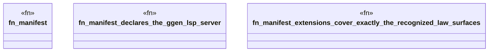

# `crates/ggen-lsp/tests/manifest_contract_test.rs`

Source SHA-256: `28593468366e7c1e2d21093f7d5afd36cf9337461532217d3ee8765b57b139d6`

## Dependencies

- `ggen_lsp::state::FileType`
- `serde_json::Value`
- `std::path::Path`

## Standing

- Structural parse: `ALIVE`
- Runtime behavior: `UNKNOWN`
