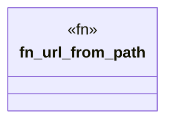

# `crates/ggen-lsp/tests/marketplace_pack_test.rs`

Source SHA-256: `257c501d1b56466b74d50ff2b1f2cb1b92f8a00f1d4014a2de8dd20ecf64d6b6`

## Dependencies

- `ggen_lsp::intel::events::activity`
- `ggen_lsp::route::default_pack_routes_path`
- `ggen_lsp::state::ServerState`
- `ggen_lsp::{check_content, envelope_for_diagnostic, init_project, IntelLog, RouteRegistry}`
- `lsp_max::lsp_types::Url`
- `tempfile::TempDir`

## Standing

- Structural parse: `ALIVE`
- Runtime behavior: `UNKNOWN`
