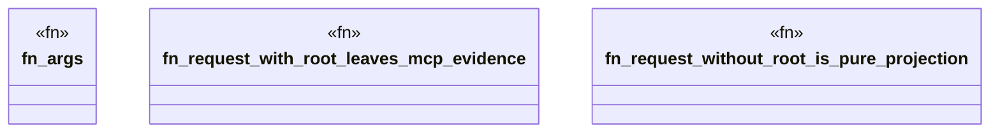

# `crates/ggen-lsp/tests/mcp_field_gauge_test.rs`

Source SHA-256: `2801e48934af63c5c99e2ff5d3946fbdf6223cd70577fdb83e743e981f0f61f3`

## Dependencies

- `ggen_lsp::IntelLog`
- `ggen_lsp::mcp::{repair_route_captured, repair_route_result}`
- `tempfile::TempDir`

## Standing

- Structural parse: `ALIVE`
- Runtime behavior: `UNKNOWN`
