# `crates/ggen-lsp/tests/mcp_harden_test.rs`

Source SHA-256: `f1c51c8747682d728bb7301c90ac44a75b56ca595303d27a60912051f9468a3d`

```mermaid
classDiagram
    class fn_args {
      <<fn>>
    }
    class fn_missing_arguments_is_a_structured_refusal {
      <<fn>>
    }
    class fn_missing_required_field_is_a_structured_refusal {
      <<fn>>
    }
    class fn_empty_file_path_is_refused {
      <<fn>>
    }
    class fn_oversized_content_is_refused {
      <<fn>>
    }
    class fn_non_law_surface_is_not_an_error {
      <<fn>>
    }
    class fn_valid_input_returns_envelopes {
      <<fn>>
    }
    class fn_root_authority_is_explicit_not_cwd_magic {
      <<fn>>
    }
```

## Dependencies

- `ggen_lsp::mcp::{build_repair_routes_in, repair_route_result}`

## Standing

- Structural parse: `ALIVE`
- Runtime behavior: `UNKNOWN`
