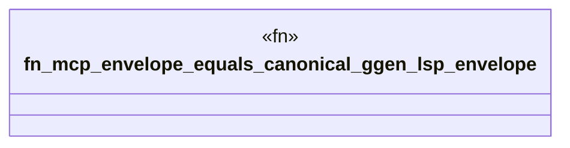

# `crates/ggen-lsp/tests/mcp_parity_test.rs`

Source SHA-256: `20b7259166f208cbf8a0e1fbcb20bd32689660f2733b78bdbf1c982525123d5c`

## Dependencies

- `ggen_lsp::mcp::build_repair_routes`
- `std::path::Path`

## Standing

- Structural parse: `ALIVE`
- Runtime behavior: `UNKNOWN`
