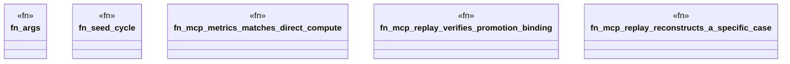

# `crates/ggen-lsp/tests/mcp_replay_metrics_test.rs`

Source SHA-256: `fb6d20e1d279b3b63c058a5b2178803c54097f8af8501bd0dacf7d7289a018c0`

## Dependencies

- `ggen_lsp::mcp::{metrics_result, replay_case_result}`
- `ggen_lsp::{check_files_in_root, compute_metrics, mine, verify_promotion}`
- `std::fs`
- `std::path::Path`
- `tempfile::TempDir`

## Standing

- Structural parse: `ALIVE`
- Runtime behavior: `UNKNOWN`
