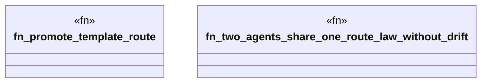

# `crates/ggen-lsp/tests/multi_agent_test.rs`

Source SHA-256: `24fd635b5362713b70caabe46c7b4015a8c198b5bb3a3b56414ffc2d8f788fe6`

## Dependencies

- `ggen_lsp::intel::events::{activity, obj_type}`
- `ggen_lsp::{check_files_in_root, mine, replay_case, IntelLog}`
- `std::fs`
- `std::path::Path`
- `tempfile::TempDir`

## Standing

- Structural parse: `ALIVE`
- Runtime behavior: `UNKNOWN`
