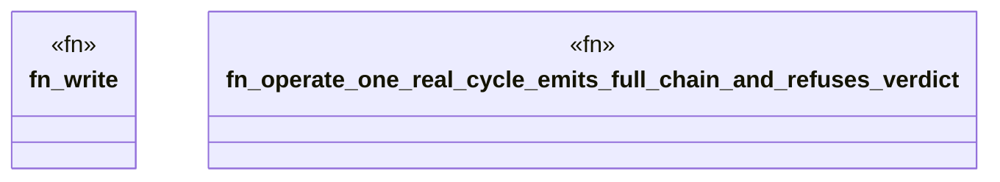

# `crates/ggen-lsp/tests/operate_longitudinal_test.rs`

Source SHA-256: `155168e547b535cc2a24dc1e3f7d56c548aea0cda431322b76f7361be9d2602f`

## Dependencies

- `ggen_lsp::intel::events::activity`
- `ggen_lsp::{check_files_in_root, compute_metrics, mine, IntelLog}`
- `std::fs`
- `std::path::{Path, PathBuf}`
- `tempfile::TempDir`

## Standing

- Structural parse: `ALIVE`
- Runtime behavior: `UNKNOWN`
