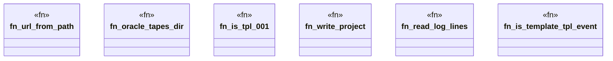

# `crates/ggen-lsp/tests/oracle_tape_generator.rs`

Source SHA-256: `3ae4a780b476ec79299546c5d4d13dd290eeb8da370cf0815d736efd795c519d`

## Dependencies

- `ggen_lsp::ServerState`
- `lsp_max::lsp_types::{NumberOrString, Url}`
- `lsp_max_protocol::MaxDiagnostic`
- `std::path::{Path, PathBuf}`

## Standing

- Structural parse: `ALIVE`
- Runtime behavior: `UNKNOWN`
