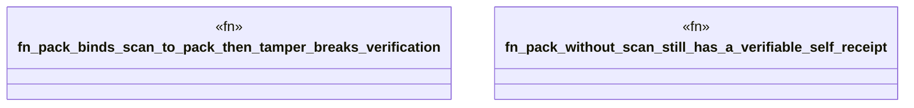

# `crates/ggen-lsp/tests/pack_receipt_test.rs`

Source SHA-256: `d6b87b23627508ff57a18a5723228e7917bc9a9282d11470e5b07c6c30a3b46f`

## Dependencies

- `ggen_lsp::{emit_pack, verify_pack, PackOptions}`
- `tempfile::TempDir`

## Standing

- Structural parse: `ALIVE`
- Runtime behavior: `UNKNOWN`
