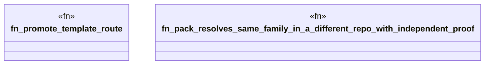

# `crates/ggen-lsp/tests/portable_pack_test.rs`

Source SHA-256: `ea53e1190d0c55ebcd33aab7c4498aca5b2c7180a94995a01ca9538b8232db4d`

## Dependencies

- `ggen_lsp::intel::events::activity`
- `ggen_lsp::route::{default_pack_routes_path, load_promoted, RouteRegistry}`
- `ggen_lsp::{check_content, check_files_in_root, mine, IntelLog}`
- `std::fs`
- `std::path::Path`
- `tempfile::TempDir`

## Standing

- Structural parse: `ALIVE`
- Runtime behavior: `UNKNOWN`
