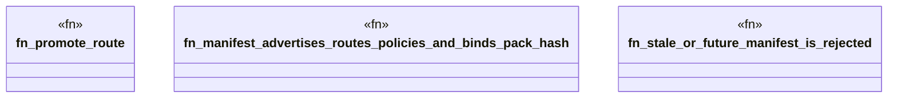

# `crates/ggen-lsp/tests/remote_pack_test.rs`

Source SHA-256: `b52ea51bc44b43571eff6012ab258f3659be06221ed2da457e1746a2238005ca`

## Dependencies

- `ggen_lsp::{ check_files_in_root, emit_pack, load_manifest, manifest_is_current, mine, pack_hash_at, PackOptions, }`
- `std::fs`
- `std::path::Path`
- `tempfile::TempDir`

## Standing

- Structural parse: `ALIVE`
- Runtime behavior: `UNKNOWN`
