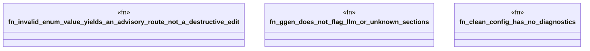

# `crates/ggen-lsp/tests/repair_route_test.rs`

Source SHA-256: `1f4fb724fb055212698989fc2ba89a78d7c5d97e033e96868764591bc3fb1756`

## Dependencies

- `ggen_lsp::RouteRegistry`
- `ggen_lsp::analyzers::build_analyzer`
- `ggen_lsp::route::{family_of_diagnostic, route_plan_for_diagnostic, RepairFamily}`

## Standing

- Structural parse: `ALIVE`
- Runtime behavior: `UNKNOWN`
