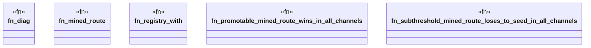

# `crates/ggen-lsp/tests/route_parity_test.rs`

Source SHA-256: `9352c2fd7ae0267bc5cecc9cd316294037c5acec42a18562a141c05595c242d8`

## Dependencies

- `ggen_lsp::route::{ action_route_for, default_pack_routes_path, route_plan_for_diagnostic, write_promoted, EditTemplate, PartialOrder, PromotedRoutes, Provenance, RepairFamily, RepairRoute, RepairStep, RouteId, RouteRegistry, StepId, }`
- `lsp_max::lsp_types::{Diagnostic, DiagnosticSeverity, NumberOrString, Position, Range}`
- `tempfile::TempDir`

## Standing

- Structural parse: `ALIVE`
- Runtime behavior: `UNKNOWN`
