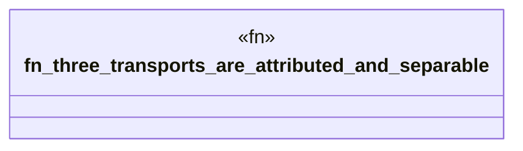

# `crates/ggen-lsp/tests/session_attribution_test.rs`

Source SHA-256: `aee55e7ff217391e47c2f97afb38d255ad0f8cb3ccb71ba4f02d64442bb48f7d`

## Dependencies

- `ggen_lsp::intel::events::obj_type`
- `ggen_lsp::{check_files_in_root, replay_case, Attribution, IntelLog}`
- `std::fs`
- `tempfile::TempDir`

## Standing

- Structural parse: `ALIVE`
- Runtime behavior: `UNKNOWN`
