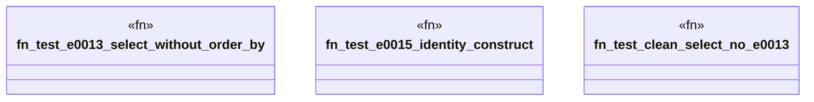

# `crates/ggen-lsp/tests/sparql_diagnostic_test.rs`

Source SHA-256: `9f8f2eb0a4cfc9b99447490f79db921892674549e21500b3cfcd8a9b6c2dd767`

## Dependencies

- `ggen_lsp::check::check_content`
- `lsp_max::lsp_types::DiagnosticSeverity`

## Standing

- Structural parse: `ALIVE`
- Runtime behavior: `UNKNOWN`
