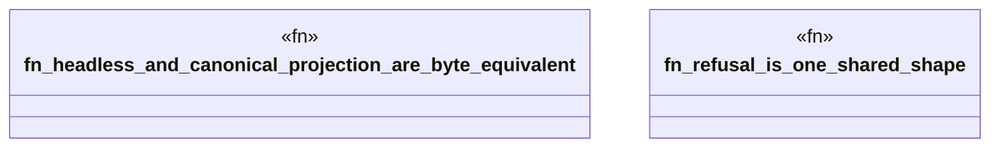

# `crates/ggen-lsp/tests/triad_contract_test.rs`

Source SHA-256: `08ffce4eb40334c6a19c91cb0284dc5dfe1d195b771824709cf7dd82af1fa8d8`

## Dependencies

- `ggen_lsp::route::{default_pack_routes_path, DiagnosticRef, RouteRefusal}`
- `ggen_lsp::{check_files_in_root, envelope_for_diagnostic, RouteRegistry}`
- `std::fs`
- `tempfile::TempDir`

## Standing

- Structural parse: `ALIVE`
- Runtime behavior: `UNKNOWN`
