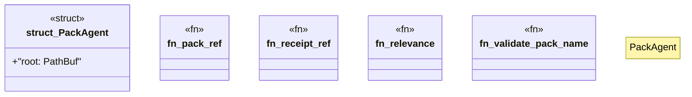

# `crates/ggen-marketplace/src/agent/facade.rs`

Source SHA-256: `6992f65c95096ffd8c6d3cb45b9cd776f37c122b5c6b556434d2138fe7aea0e6`

## Dependencies

- `crate::agent::receipt::{emit_install_receipt, verify_install_receipt, PackInstallClosure}`
- `crate::agent::types::{ AgentError, AgentResult, AgentStatus, Capabilities, CapabilityRef, CompatibilityOutcome, DependencyRef, InstallOutcome, InstallRequest, InstalledPackRef, OperationRef, PackDetail, PackRef, PackValidation, ReceiptRef, RemoveOutcome, ResolveOutcome, SearchHit, VerifyOutcome, }`
- `crate::marketplace::install::{install_pack_by_id, InstallByIdInput}`
- `crate::packs::lockfile::PackLockfile`
- `crate::packs_registry::capability_registry::{list_capabilities, resolve_capability_to_packs}`
- `crate::packs_registry::check_packs_compatibility`
- `crate::packs_registry::metadata::{list_packs, load_pack_metadata, show_pack}`
- `crate::packs_registry::types::Pack`
- `crate::packs_registry::validate::validate_pack`
- `std::path::{Path, PathBuf}`

## Standing

- Structural parse: `ALIVE`
- Runtime behavior: `UNKNOWN`
