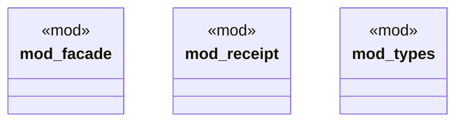

# `crates/ggen-marketplace/src/agent/mod.rs`

Source SHA-256: `feb83a0b10692cdb2f6c5df6aa3476590666deb0b189a371933bab034d421c6e`

## Dependencies

- `facade::PackAgent`
- `receipt::{ emit_install_receipt, verify_install_receipt, PackInstallClosure, PackReceiptError, }`
- `types::{ AgentError, AgentResult, AgentStatus, Capabilities, CapabilityRef, CompatibilityOutcome, DependencyRef, InstallOutcome, InstallRequest, InstalledPackRef, OperationRef, PackDetail, PackRef, PackValidation, ReceiptRef, RemoveOutcome, ResolveOutcome, SearchHit, VerifyOutcome, }`

## Standing

- Structural parse: `ALIVE`
- Runtime behavior: `UNKNOWN`
