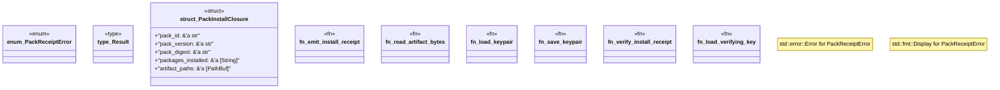

# `crates/ggen-marketplace/src/agent/receipt.rs`

Source SHA-256: `f6b1334e97c0b21bf3c5da6778008a5ef4c4ac0c4d015592aefc733cc1401eb5`

## Dependencies

- `ed25519_dalek::SECRET_KEY_LENGTH`
- `ed25519_dalek::{SecretKey, SigningKey, VerifyingKey}`
- `ggen_config::receipt::Receipt`
- `ggen_config::receipt::{hash_data, Receipt}`
- `std::fs`
- `std::path::{Path, PathBuf}`

## Standing

- Structural parse: `ALIVE`
- Runtime behavior: `UNKNOWN`
