# `crates/ggen-marketplace/src/agent/types.rs`

Source SHA-256: `e22381e49d1861074d0ecb39784bc371336e6707f6d08a24e7979091c739d92f`

```mermaid
classDiagram
    class enum_AgentError {
      <<enum>>
    }
    class type_AgentResult {
      <<type>>
    }
    class struct_PackRef {
      <<struct>>
      +"id: String"
      +"name: String"
      +"version: String"
      +"description: String"
      +"category: String"
      +"registry_type: String"
      +"production_ready: bool"
    }
    class struct_SearchHit {
      <<struct>>
      +"pack: PackRef"
      +"score: f64"
    }
    class struct_DependencyRef {
      <<struct>>
      +"pack_id: String"
      +"version: String"
      +"optional: bool"
    }
    class struct_PackValidation {
      <<struct>>
      +"valid: bool"
      +"score: f64"
      +"errors: Vec~String~"
      +"warnings: Vec~String~"
    }
    class struct_PackDetail {
      <<struct>>
      +"pack: PackRef"
      +"packages: Vec~String~"
      +"templates: Vec~String~"
      +"dependencies: Vec~DependencyRef~"
      +"sparql_query_count: usize"
      +"validation: PackValidation"
    }
    class struct_ResolveOutcome {
      <<struct>>
      +"surface: String"
      +"projection: Option~String~"
      +"runtime: Option~String~"
      +"resolved: Vec~String~"
      +"missing: Vec~String~"
      +"install_hints: Vec~String~"
    }
    class struct_CompatibilityOutcome {
      <<struct>>
      +"pack_ids: Vec~String~"
      +"compatible: bool"
      +"conflicts: Vec~String~"
      +"warnings: Vec~String~"
      +"message: String"
    }
    class struct_ReceiptRef {
      <<struct>>
      +"receipt_path: String"
      +"operation_id: String"
      +"signature_present: bool"
    }
    class struct_InstallOutcome {
      <<struct>>
      +"pack_id: String"
      +"pack_name: String"
      +"pack_version: String"
      +"packages_installed: Vec~String~"
      +"templates_available: Vec~String~"
      +"digest: String"
      +"install_path: String"
      +"lockfile_path: Option~String~"
      +"receipt: Option~ReceiptRef~"
      +"dry_run: bool"
    }
    class struct_RemoveOutcome {
      <<struct>>
      +"pack_id: String"
      +"removed: bool"
      +"lockfile_path: String"
      +"remaining: Vec~String~"
    }
    class struct_VerifyOutcome {
      <<struct>>
      +"receipt_path: String"
      +"is_valid: bool"
      +"operation_id: Option~String~"
      +"reason: Option~String~"
    }
    class struct_InstalledPackRef {
      <<struct>>
      +"pack_id: String"
      +"version: String"
      +"integrity: Option~String~"
      +"installed_at: String"
    }
    class struct_AgentStatus {
      <<struct>>
      +"lockfile_present: bool"
      +"lockfile_path: String"
      +"ggen_version: Option~String~"
      +"installed: Vec~InstalledPackRef~"
    }
    class struct_CapabilityRef {
      <<struct>>
      +"id: String"
      +"name: String"
      +"description: String"
      +"category: String"
      +"atomic_packs: Vec~String~"
    }
    class struct_OperationRef {
      <<struct>>
      +"name: String"
      +"description: String"
      +"mutating: bool"
    }
    class struct_Capabilities {
      <<struct>>
      +"operations: Vec~OperationRef~"
      +"surfaces: Vec~CapabilityRef~"
    }
    class struct_InstallRequest {
      <<struct>>
      +"pack_id: String"
      +"force: bool"
      +"dry_run: bool"
      +"emit_receipt: bool"
    }
    class fn_default_true {
      <<fn>>
    }
    note "InstallRequest"
```

## Dependencies

- `serde::{Deserialize, Serialize}`

## Standing

- Structural parse: `ALIVE`
- Runtime behavior: `UNKNOWN`
