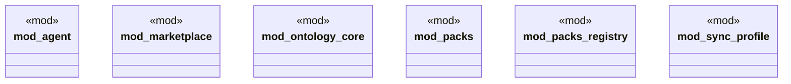

# `crates/ggen-marketplace/src/lib.rs`

Source SHA-256: `154e12edb4b64dbe027d2b05bdfb302bfe78500ae06c22a32ebad639a49a1fd1`

## Dependencies

- `marketplace::{ all_fortune5_contracts, fortune5_contract, CausalPolarity, ConformityMark, Fortune5Assessment, Fortune5AssessmentReceipt, Fortune5Capability, Fortune5CapabilityAssessment, Fortune5CapabilityContract, Fortune5Category, Fortune5Error, Fortune5EvidenceLedger, Fortune5EvidenceOutcome, Fortune5EvidenceRecord, Fortune5Proof, Fortune5ProofSurface, Fortune5Reference, Fortune5Standing, HostProfile, InputEnvelope, IsolationClass, LifecyclePolicy, LifecycleState, Manifest, NonInterferenceProfile, OutputContract, Package, PackageId, PartIdentity, PartPassport, PassportBinding, PassportValidationReport, ProtocolRange, QualityScore, RdfRegistry, ResourceEnvelope, RetirementPolicy, SparqlSearchEngine, SubstitutionReport, TemporalProfile, VerifierMark, VerifierStatus, ALL_FORTUNE5_CAPABILITIES, CURRENT_PASSPORT_SCHEMA, FORTUNE5_CONTRACT_VERSION, REQUIRED_PROOF_SURFACES, }`

## Standing

- Structural parse: `ALIVE`
- Runtime behavior: `UNKNOWN`
