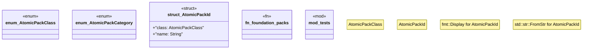

# `crates/ggen-marketplace/src/marketplace/atomic.rs`

Source SHA-256: `c62d31753ee73762db50b7e2f8d983d834c749dd1a9594b64e438d9d06ccfb00`

## Dependencies

- `serde::{Deserialize, Serialize}`
- `std::fmt`
- `super::*`

## Standing

- Structural parse: `ALIVE`
- Runtime behavior: `UNKNOWN`
