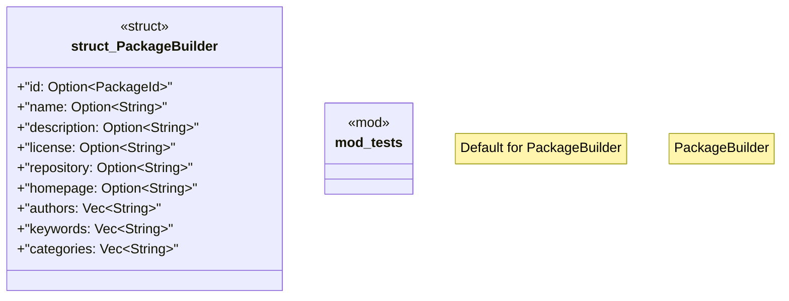

# `crates/ggen-marketplace/src/marketplace/builders.rs`

Source SHA-256: `1e61290f29f7c43910357c8fa2113480b97081caa785eb56f2186fe0c83a4973`

## Dependencies

- `crate::marketplace::error::Result`
- `crate::marketplace::models::{PackageId, PackageMetadata}`
- `super::*`

## Standing

- Structural parse: `ALIVE`
- Runtime behavior: `UNKNOWN`
