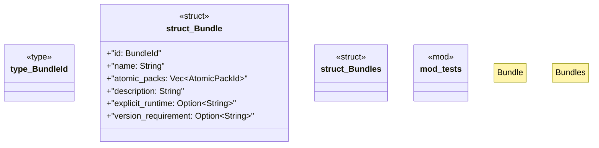

# `crates/ggen-marketplace/src/marketplace/bundle.rs`

Source SHA-256: `b225d1157a7e15efbacc3c24d62d392b5e30375a787a8dbb67abdf7689e6ae50`

## Dependencies

- `crate::marketplace::atomic::AtomicPackId`
- `serde::{Deserialize, Serialize}`
- `std::collections::HashSet`
- `super::*`

## Standing

- Structural parse: `ALIVE`
- Runtime behavior: `UNKNOWN`
