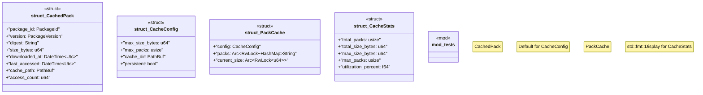

# `crates/ggen-marketplace/src/marketplace/cache.rs`

Source SHA-256: `5efcbc0f1eda9329ebca3c0036e6bfc6de33dbdb7cf73b3ed93a829cd4d91490`

## Dependencies

- `chrono::{DateTime, Utc}`
- `crate::marketplace::error::{Error, Result}`
- `crate::marketplace::models::{PackageId, PackageVersion}`
- `serde::{Deserialize, Serialize}`
- `sha2::{Digest, Sha256}`
- `std::collections::HashMap`
- `std::fs`
- `std::io::{BufReader, BufWriter}`
- `std::path::PathBuf`
- `std::sync::{Arc, RwLock}`
- `super::*`
- `tempfile::TempDir`
- `tracing::{debug, info, warn}`

## Standing

- Structural parse: `ALIVE`
- Runtime behavior: `UNKNOWN`
