# `crates/ggen-marketplace/src/marketplace/compatibility.rs`

Source SHA-256: `529f6bc7417af89e096145f33da4c6453915f19ca69185e7e5a9f7849989d129`

```mermaid
classDiagram
    class enum_CompatibilityDimension {
      <<enum>>
    }
    class enum_ConflictSeverity {
      <<enum>>
    }
    class struct_ReceiptSchemaMeta {
      <<struct>>
      +"schema_version: String"
      +"signature_algorithm: Option~String~"
      +"hash_function: Option~String~"
      +"chain_depth_max: Option~u32~"
    }
    class enum_ConflictResolution {
      <<enum>>
    }
    class struct_Conflict {
      <<struct>>
      +"dimension: CompatibilityDimension"
      +"packs: Vec~AtomicPackId~"
      +"description: String"
      +"severity: ConflictSeverity"
      +"resolution: Option~ConflictResolution~"
      +"context: BTreeMap~String"
    }
    class struct_CompatibilityReport {
      <<struct>>
      +"compatible: bool"
      +"conflicts: Vec~Conflict~"
      +"packs_checked: Vec~AtomicPackId~"
    }
    class struct_CompatibilityChecker {
      <<struct>>
      +"cache_dir: std::path::PathBuf"
    }
    class mod_tests {
      <<mod>>
    }
    note "CompatibilityChecker"
    note "CompatibilityReport"
    note "Conflict"
    note "Default for CompatibilityChecker"
    note "Default for ReceiptSchemaMeta"
    note "fmt::Display for CompatibilityDimension"
    note "fmt::Display for ConflictSeverity"
```

## Dependencies

- `crate::marketplace::atomic::AtomicPackCategory`
- `crate::marketplace::atomic::AtomicPackClass`
- `crate::marketplace::atomic::{AtomicPackCategory, AtomicPackClass}`
- `crate::marketplace::atomic::{AtomicPackClass, AtomicPackId}`
- `crate::marketplace::error::{Error, Result}`
- `crate::marketplace::ownership::{ MergeStrategy, OwnershipClass, OwnershipDeclaration, OwnershipTarget, }`
- `crate::marketplace::ownership::{MergeStrategy, OwnershipClass}`
- `crate::marketplace::ownership::{OwnershipClass, OwnershipTarget}`
- `serde::{Deserialize, Serialize}`
- `std::collections::{BTreeMap, HashMap}`
- `std::fmt`
- `std::io::Read`
- `std::path::PathBuf`
- `super::*`

## Standing

- Structural parse: `ALIVE`
- Runtime behavior: `UNKNOWN`
