# `crates/ggen-marketplace/src/marketplace/composition_receipt.rs`

Source SHA-256: `1fcc8dfcc6df3728704e7d8eb917b44e9a266bea7bfe33d3dd41ee1f415d632c`

```mermaid
classDiagram
    class struct_AtomicPackRef {
      <<struct>>
      +"pack_id: String"
      +"version: String"
      +"digest: String"
      +"signature: String"
      +"trust_tier: TrustTier"
    }
    class struct_BundleExpansion {
      <<struct>>
      +"bundle_id: String"
      +"expanded_to: Vec~String~"
    }
    class struct_GraphFragment {
      <<struct>>
      +"id: String"
      +"triple_count: usize"
      +"digest: String"
    }
    class struct_SparqlQuery {
      <<struct>>
      +"name: String"
      +"query: String"
      +"result_count: usize"
    }
    class struct_TemplateRef {
      <<struct>>
      +"template_id: String"
      +"path: String"
      +"render_count: usize"
    }
    class struct_ValidatorRef {
      <<struct>>
      +"name: String"
      +"version: String"
      +"passed: bool"
    }
    class struct_PolicyRef {
      <<struct>>
      +"policy_id: String"
      +"profile: String"
      +"rule: String"
    }
    class struct_ConflictResolution {
      <<struct>>
      +"conflict_type: String"
      +"packs: Vec~String~"
      +"resolution: String"
      +"explanation: String"
    }
    class struct_OutputPath {
      <<struct>>
      +"path: String"
      +"digest: String"
      +"generated_by: Option~String~"
    }
    class struct_RuntimeProfile {
      <<struct>>
      +"profile_id: String"
      +"runtime_constraints: Vec~String~"
      +"trust_requirement: TrustTier"
    }
    class struct_CompositionReceipt {
      <<struct>>
      +"receipt_id: Option~String~"
      +"parent_receipt_id: Option~String~"
      +"atomic_packs: Vec~AtomicPackRef~"
      +"bundle_aliases: Vec~BundleExpansion~"
      +"versions: BTreeMap~String"
      +"signatures: Vec~SignatureRecord~"
      +"ontology_fragments: Vec~GraphFragment~"
      +"queries_executed: Vec~SparqlQuery~"
      +"templates_rendered: Vec~TemplateRef~"
      +"validators_applied: Vec~ValidatorRef~"
      +"policies_enforced: Vec~PolicyRef~"
      +"conflicts: Vec~ConflictResolution~"
      +"ownership_map: BTreeMap~String"
      +"artifact_hashes: Vec~OutputPath~"
      +"runtime_context: RuntimeProfile"
      +"receipt_chain: ReceiptChain"
    }
    class struct_SignatureRecord {
      <<struct>>
      +"pack_id: String"
      +"public_key: String"
      +"signature: String"
      +"checksum: String"
      +"verified: bool"
    }
    class struct_OwnershipRecord {
      <<struct>>
      +"target: String"
      +"class: String"
      +"owner_pack: String"
      +"merge_strategy: Option~String~"
    }
    class fn_sha2_digest {
      <<fn>>
    }
    class mod_tests {
      <<mod>>
    }
    note "CompositionReceipt"
```

## Dependencies

- `crate::marketplace::error::Error`
- `crate::marketplace::error::Result`
- `crate::marketplace::trust::TrustTier`
- `ggen_config::{Receipt, ReceiptChain}`
- `serde::{Deserialize, Serialize}`
- `sha2::{Digest, Sha256}`
- `std::collections::{BTreeMap, HashSet}`
- `super::*`

## Standing

- Structural parse: `ALIVE`
- Runtime behavior: `UNKNOWN`
