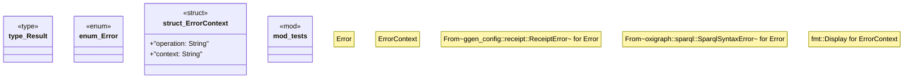

# `crates/ggen-marketplace/src/marketplace/error.rs`

Source SHA-256: `15b4f6c1e5f19556daad1c7ab9852840230acc30f717a20ef76e6a231335fc2f`

## Dependencies

- `std::fmt`
- `super::*`
- `thiserror::Error`

## Standing

- Structural parse: `ALIVE`
- Runtime behavior: `UNKNOWN`
