# `crates/ggen-marketplace/src/marketplace/fmea_mitigations.rs`

Source SHA-256: `9912e038c4e877b321e445d23b059badc8f57ef371ba040905b569e8dbe847cc`

```mermaid
classDiagram
    class enum_FailureMode {
      <<enum>>
    }
    class enum_Severity {
      <<enum>>
    }
    class enum_Occurrence {
      <<enum>>
    }
    class enum_Detection {
      <<enum>>
    }
    class struct_RiskPriorityNumber {
      <<struct>>
    }
    class struct_FailureRecord {
      <<struct>>
      +"mode: FailureMode"
      +"occurred_at: DateTime~Utc~"
      +"context: String"
      +"severity: Severity"
      +"recovery_attempted: bool"
      +"recovery_successful: bool"
      +"rpn: RiskPriorityNumber"
    }
    class struct_FmeaMitigations {
      <<struct>>
      +"failure_history: Arc~RwLock~Vec~FailureRecord~~~"
      +"failure_counts: Arc~RwLock~HashMap~FailureMode"
      +"alert_threshold: u32"
    }
    class enum_RecoveryAction {
      <<enum>>
    }
    class struct_FailureStatistics {
      <<struct>>
      +"total_failures: usize"
      +"unique_modes: usize"
      +"high_risk_count: usize"
      +"critical_risk_count: usize"
      +"mode_counts: HashMap~FailureMode"
    }
    class mod_tests {
      <<mod>>
    }
    note "Default for FmeaMitigations"
    note "FmeaMitigations"
    note "RiskPriorityNumber"
```

## Dependencies

- `chrono::{DateTime, Utc}`
- `crate::marketplace::error::{Error, Result}`
- `crate::marketplace::rdf::poka_yoke::PackageId`
- `parking_lot::RwLock`
- `std::collections::HashMap`
- `std::sync::Arc`
- `super::*`
- `tracing::{error, warn, info}`

## Standing

- Structural parse: `ALIVE`
- Runtime behavior: `UNKNOWN`
