# `crates/ggen-marketplace/src/marketplace/install.rs`

Source SHA-256: `bcd72af0887a7785e29c26d9a24858fa35f4080515d281eea4e4fbf605fb2ec2`

```mermaid
classDiagram
    class struct_Installer {
      <<struct>>
      +"repository: R"
      +"cache: PackCache"
      +"profile: Option~Profile~"
    }
    class type_ProgressCallback {
      <<type>>
    }
    class struct_TransactionSnapshot {
      <<struct>>
      +"installed_packages: Vec~(PackageId"
    }
    class fn_detect_format {
      <<fn>>
    }
    class fn_is_tar_gz {
      <<fn>>
    }
    class fn_is_zip {
      <<fn>>
    }
    class enum_PackFormat {
      <<enum>>
    }
    class struct_InstallationPlan {
      <<struct>>
      +"id: Uuid"
      +"packages: Vec~PackageInstallPlan~"
      +"total_size: u64"
      +"estimated_time: std::time::Duration"
    }
    class struct_PackageInstallPlan {
      <<struct>>
      +"id: PackageId"
      +"version: PackageVersion"
      +"size: u64"
    }
    class struct_Lockfile {
      <<struct>>
      +"version: u32"
      +"manifest_id: uuid::Uuid"
      +"packages: indexmap::IndexMap~PackageId"
      +"created_at: chrono::DateTime~chrono::Utc~"
    }
    class struct_BatchInstallationResult {
      <<struct>>
      +"manifest_id: Uuid"
      +"packages_installed: usize"
      +"total_packages: usize"
      +"duration: std::time::Duration"
    }
    class struct_InstallByIdInput {
      <<struct>>
      +"pack_id: String"
      +"target_dir: Option~PathBuf~"
      +"force: bool"
      +"dry_run: bool"
    }
    class struct_InstallByIdOutput {
      <<struct>>
      +"pack_id: String"
      +"pack_name: String"
      +"pack_version: String"
      +"packages_installed: Vec~String~"
      +"templates_available: Vec~String~"
      +"sparql_queries: usize"
      +"total_packages: usize"
      +"install_path: PathBuf"
      +"digest: String"
      +"lockfile_path: Option~PathBuf~"
    }
    class fn_compute_pack_digest {
      <<fn>>
    }
    class fn_write_lockfile_entry {
      <<fn>>
    }
    class fn_materialize_local_pack {
      <<fn>>
    }
    class mod_tests {
      <<mod>>
    }
    note "Installable for Installer~R~"
    note "Installer~R~"
    note "Lockfile"
    note "std::fmt::Display for BatchInstallationResult"
    note "std::fmt::Display for InstallationPlan"
```

## Dependencies

- `async_trait::async_trait`
- `crate::marketplace::cache::CacheConfig`
- `crate::marketplace::cache::{CachedPack, PackCache}`
- `crate::marketplace::error::{Error, Result}`
- `crate::marketplace::models::{InstallationManifest, PackageId, PackageVersion}`
- `crate::marketplace::profile::Profile`
- `crate::marketplace::profile::enterprise_strict_profile`
- `crate::marketplace::profile::regulated_finance_profile`
- `crate::marketplace::registry::Registry`
- `crate::marketplace::security::ChecksumCalculator`
- `crate::marketplace::security::{MarketplaceSignature, MarketplaceVerifier}`
- `crate::marketplace::traits::{AsyncRepository, Installable}`
- `crate::marketplace::trust::{RegistryClass, TrustTier}`
- `crate::packs::lockfile::{LockedPack, PackLockfile, PackSource}`
- `crate::packs_registry::external_fetcher::ExternalFetcherFactory`
- `crate::packs_registry::types::Pack`
- `flate2::read::GzDecoder`
- `reqwest::Client`
- `semver::Version`
- `serial_test::serial`
- `sha2::{Digest, Sha256}`
- `std::collections::{HashMap, HashSet}`
- `std::fs::{self, File}`
- `std::io::BufWriter`
- `std::path::Component`
- `std::path::{Path, PathBuf}`
- `super::*`
- `tar::Archive`
- `tempfile::TempDir`
- `tracing::{debug, info, instrument, span, warn}`
- `uuid::Uuid`
- `zip::ZipArchive`

## Standing

- Structural parse: `ALIVE`
- Runtime behavior: `UNKNOWN`
