# `crates/ggen-marketplace/src/marketplace/metadata.rs`

Source SHA-256: `2b1acf44502707a243505ebfa6ab5c11f55a29888d5b58ecd0becfd97a5d45a1`

```mermaid
classDiagram
    class struct_PackMetadata {
      <<struct>>
      +"signature: Option~String~"
      +"trust_tier: TrustTier"
      +"checksum: Option~String~"
      +"registry_type: Option~RegistryType~"
      +"origin_url: Option~String~"
      +"outputs: HashMap~String"
    }
    class struct_PackageToml {
      <<struct>>
      +"package: PackageSection"
      +"security: Option~SecuritySection~"
      +"pack: Option~PackSection~"
    }
    class struct_PackSection {
      <<struct>>
      +"outputs: HashMap~String"
    }
    class struct_PackageSection {
      <<struct>>
      +"name: String"
      +"version: String"
      +"registry_type: Option~String~"
      +"origin_url: Option~String~"
    }
    class struct_SecuritySection {
      <<struct>>
      +"signature: Option~String~"
      +"trust_tier: Option~String~"
      +"checksum: Option~String~"
    }
    class struct_MetadataJson {
      <<struct>>
      +"signature: Option~String~"
      +"trust_tier: Option~String~"
      +"checksum: Option~String~"
      +"registry_type: Option~String~"
      +"origin_url: Option~String~"
    }
    class fn_load_pack_metadata {
      <<fn>>
    }
    class fn_load_from_toml {
      <<fn>>
    }
    class fn_load_from_json {
      <<fn>>
    }
    class fn_parse_trust_tier {
      <<fn>>
    }
    class fn_pack_cache_root {
      <<fn>>
    }
    class fn_pack_cache_dir {
      <<fn>>
    }
    class fn_get_pack_cache_dir {
      <<fn>>
    }
    class mod_tests {
      <<mod>>
    }
    note "Default for PackMetadata"
```

## Dependencies

- `crate::marketplace::error::{Error, Result}`
- `crate::marketplace::models::PackageId`
- `crate::marketplace::trust::{RegistryType, TrustTier}`
- `serde::Deserialize`
- `serial_test::serial`
- `std::collections::HashMap`
- `std::fs`
- `std::path::{Path, PathBuf}`
- `super::*`
- `tempfile::TempDir`
- `tracing::{debug, warn}`

## Standing

- Structural parse: `ALIVE`
- Runtime behavior: `UNKNOWN`
