# `crates/ggen-marketplace/src/marketplace/metrics.rs`

Source SHA-256: `77cae5bc1839b085d3c0de683439905bcedbb8aad9d802a4e48242ac4207a572`

```mermaid
classDiagram
    class struct_MetricsCollector {
      <<struct>>
      +"searches: Arc~AtomicU64~"
      +"search_hits: Arc~AtomicU64~"
      +"installations: Arc~AtomicU64~"
      +"validations: Arc~AtomicU64~"
      +"signature_verifications: Arc~AtomicU64~"
      +"avg_search_duration_ms: Arc~AtomicI64~"
      +"avg_install_duration_ms: Arc~AtomicI64~"
      +"events: Arc~DashMap~String"
    }
    class struct_EventMetric {
      <<struct>>
      +"name: String"
      +"count: u64"
      +"first_at: chrono::DateTime~chrono::Utc~"
      +"last_at: chrono::DateTime~chrono::Utc~"
    }
    class struct_SearchMetrics {
      <<struct>>
      +"total_searches: u64"
      +"successful_searches: u64"
      +"success_rate: f64"
      +"avg_duration_ms: u64"
    }
    class struct_InstallationMetrics {
      <<struct>>
      +"total_installations: u64"
      +"avg_duration_ms: u64"
    }
    class struct_MetricsSummary {
      <<struct>>
      +"searches: SearchMetrics"
      +"installations: InstallationMetrics"
      +"validations: u64"
      +"signature_verifications: u64"
      +"events_count: u64"
    }
    class mod_tests {
      <<mod>>
    }
    note "Default for MetricsCollector"
    note "MetricsCollector"
    note "Observable for MetricsCollector"
    note "std::fmt::Display for InstallationMetrics"
    note "std::fmt::Display for MetricsSummary"
    note "std::fmt::Display for SearchMetrics"
```

## Dependencies

- `async_trait::async_trait`
- `crate::marketplace::error::Result`
- `crate::marketplace::traits::Observable`
- `dashmap::DashMap`
- `std::sync::Arc`
- `std::sync::atomic::{AtomicI64, AtomicU64, Ordering}`
- `super::*`
- `tracing::debug`

## Standing

- Structural parse: `ALIVE`
- Runtime behavior: `UNKNOWN`
