# `crates/ggen-marketplace/src/marketplace/migration.rs`

Source SHA-256: `54a58fefaef4e2cfc237b5546a709973a93289a1d517215afdd8b882d32dd7e2`

```mermaid
classDiagram
    class struct_UpgradeEdge {
      <<struct>>
      +"from: PackageVersion"
      +"to: PackageVersion"
      +"is_direct: bool"
    }
    class struct_Migrator {
      <<struct>>
      +"upgrade_graph: HashMap~PackageVersion"
      +"rollback_states: HashMap~String"
    }
    class struct_MigrationCoordinator {
      <<struct>>
      +"target: Arc~RdfRegistry~"
    }
    class struct_MigrationReport {
      <<struct>>
      +"total_packages: usize"
      +"migrated_packages: usize"
      +"skipped_packages: usize"
      +"errors: Vec~String~"
    }
    class struct_VerificationReport {
      <<struct>>
      +"total_packages: usize"
      +"verified_packages: usize"
      +"mismatches: Vec~String~"
      +"errors: Vec~String~"
    }
    class struct_ConsistencyChecker {
      <<struct>>
      +"rdf_registry: Arc~RdfRegistry~"
    }
    class struct_ConsistencyResult {
      <<struct>>
      +"package_id: String"
      +"is_consistent: bool"
      +"differences: Vec~String~"
    }
    class struct_ConsistencyReport {
      <<struct>>
      +"total_packages: usize"
      +"consistent_packages: usize"
      +"inconsistent_packages: Vec~ConsistencyResult~"
      +"errors: Vec~String~"
    }
    class mod_tests {
      <<mod>>
    }
    note "ConsistencyChecker"
    note "ConsistencyReport"
    note "ConsistencyResult"
    note "Default for Migrator"
    note "MigrationCoordinator"
    note "MigrationReport"
    note "Migrator"
    note "UpgradeEdge"
    note "VerificationReport"
    note "std::fmt::Display for ConsistencyReport"
    note "std::fmt::Display for MigrationReport"
    note "std::fmt::Display for VerificationReport"
```

## Dependencies

- `crate::marketplace::error::Result`
- `crate::marketplace::models::PackageMetadata`
- `crate::marketplace::models::{Package, PackageId, PackageVersion, ReleaseInfo}`
- `crate::marketplace::registry_rdf::RdfRegistry`
- `crate::marketplace::traits::AsyncRepository`
- `crate::marketplace::trust::TrustTier`
- `semver::Version`
- `std::collections::{HashMap, VecDeque}`
- `std::sync::Arc`
- `super::*`
- `tracing::{info, warn}`

## Standing

- Structural parse: `ALIVE`
- Runtime behavior: `UNKNOWN`
