# `crates/ggen-marketplace/src/marketplace/mod.rs`

Source SHA-256: `6ed12afe47f9135b578d52b507cb49ef7e077b6c9420a6d1760a366fb244d2c6`

```mermaid
classDiagram
    class mod_atomic {
      <<mod>>
    }
    class mod_builders {
      <<mod>>
    }
    class mod_bundle {
      <<mod>>
    }
    class mod_cache {
      <<mod>>
    }
    class mod_compatibility {
      <<mod>>
    }
    class mod_composition_receipt {
      <<mod>>
    }
    class mod_error {
      <<mod>>
    }
    class mod_fortune5 {
      <<mod>>
    }
    class mod_install {
      <<mod>>
    }
    class mod_metadata {
      <<mod>>
    }
    class mod_metrics {
      <<mod>>
    }
    class mod_migration {
      <<mod>>
    }
    class mod_models {
      <<mod>>
    }
    class mod_network {
      <<mod>>
    }
    class mod_ontology {
      <<mod>>
    }
    class mod_ownership {
      <<mod>>
    }
    class mod_part_passport {
      <<mod>>
    }
    class mod_policy {
      <<mod>>
    }
    class mod_profile {
      <<mod>>
    }
    class mod_rdf {
      <<mod>>
    }
    class mod_rdf_mapper {
      <<mod>>
    }
    class mod_registry {
      <<mod>>
    }
    class mod_registry_rdf {
      <<mod>>
    }
    class mod_search {
      <<mod>>
    }
    class mod_search_sparql {
      <<mod>>
    }
    class mod_security {
      <<mod>>
    }
    class mod_traits {
      <<mod>>
    }
    class mod_trust {
      <<mod>>
    }
    class mod_v3 {
      <<mod>>
    }
    class mod_validation {
      <<mod>>
    }
    class mod_prelude {
      <<mod>>
    }
```

## Dependencies

- `composition_receipt::CompositionReceipt`
- `crate::marketplace::{ composition_receipt::CompositionReceipt, error::{Error, Result}, fortune5::{ all_fortune5_contracts, fortune5_contract, Fortune5Assessment, Fortune5AssessmentReceipt, Fortune5Capability, Fortune5CapabilityAssessment, Fortune5CapabilityContract, Fortune5Category, Fortune5Error, Fortune5EvidenceLedger, Fortune5EvidenceOutcome, Fortune5EvidenceRecord, Fortune5Proof, Fortune5ProofSurface, Fortune5Reference, Fortune5Standing, ALL_FORTUNE5_CAPABILITIES, FORTUNE5_CONTRACT_VERSION, REQUIRED_PROOF_SURFACES, }, install::Installer, metrics::MetricsCollector, migration::{Migrator, UpgradeEdge}, models::{Manifest, Package, PackageId, PackageMetadata, PackageVersion}, network::{MarketplaceClient, PackageMetadata as NetworkPackageMetadata}, part_passport::{ CausalPolarity, ClockDiscipline, ConformityMark, HostProfile, InputEnvelope, IsolationClass, LifecyclePolicy, LifecycleState, NonInterferenceProfile, OutputContract, PartIdentity, PartPassport, PassportBinding, ProtocolRange, ResourceEnvelope, RetirementPolicy, TemporalProfile, TimeoutSemantics, VerifierMark, VerifierStatus, CURRENT_PASSPORT_SCHEMA, }, registry::Registry, registry_rdf::RdfRegistry, search::SearchEngine, search_sparql::SparqlSearchEngine, security::MarketplaceVerifier, traits::{AsyncRepository, Installable, Observable, Queryable, Signable, Validatable}, v3::V3OptimizedRegistry, validation::Validator, }`
- `error::{Error, Result}`
- `fortune5::{ all_fortune5_contracts, fortune5_contract, Fortune5Assessment, Fortune5AssessmentReceipt, Fortune5Capability, Fortune5CapabilityAssessment, Fortune5CapabilityContract, Fortune5Category, Fortune5Error, Fortune5EvidenceLedger, Fortune5EvidenceOutcome, Fortune5EvidenceRecord, Fortune5Proof, Fortune5ProofSurface, Fortune5Reference, Fortune5Standing, ALL_FORTUNE5_CAPABILITIES, FORTUNE5_CONTRACT_VERSION, REQUIRED_PROOF_SURFACES, }`
- `install::Installer`
- `metrics::MetricsCollector`
- `migration::{Migrator, UpgradeEdge}`
- `models::*`
- `network::{MarketplaceClient, PackageMetadata as NetworkPackageMetadata}`
- `part_passport::{ CausalPolarity, ClockDiscipline, ConformityMark, HostProfile, InputEnvelope, IsolationClass, LifecyclePolicy, LifecycleState, NameplateMark, NonInterferenceProfile, OutputContract, PartIdentity, PartPassport, PassportBinding, PassportValidationReport, PassportViolation, PassportViolationCode, ProtocolRange, ResourceEnvelope, RetirementPolicy, SubstitutionReport, SubstitutionViolation, SubstitutionViolationCode, TemporalProfile, TimeoutSemantics, VerifierMark, VerifierStatus, CURRENT_PASSPORT_SCHEMA, }`
- `registry::Registry`
- `registry_rdf::RdfRegistry`
- `search::SearchEngine`
- `search_sparql::SparqlSearchEngine`
- `security::MarketplaceVerifier`
- `traits::*`
- `v3::V3OptimizedRegistry`
- `validation::Validator`

## Standing

- Structural parse: `ALIVE`
- Runtime behavior: `UNKNOWN`
