# `crates/ggen-marketplace/src/marketplace/models.rs`

Source SHA-256: `60950a074c75dc195238ffd1bc82df35fc1e584a05e1ef3362cc5bafc3c29a04`

```mermaid
classDiagram
    class struct_Draft {
      <<struct>>
    }
    class struct_Published {
      <<struct>>
    }
    class enum_PackageState {
      <<enum>>
    }
    class struct_GgenOntology {
      <<struct>>
      +"namespace: String"
    }
    class enum_SignatureAlgorithm {
      <<enum>>
    }
    class struct_LicenseId {
      <<struct>>
    }
    class struct_AuthorEmail {
      <<struct>>
    }
    class struct_Keyword {
      <<struct>>
    }
    class struct_Category {
      <<struct>>
    }
    class struct_Checksum {
      <<struct>>
    }
    class struct_RepositoryUrl {
      <<struct>>
    }
    class struct_PackageId {
      <<struct>>
    }
    class struct_PackageVersion {
      <<struct>>
    }
    class struct_QualityScore {
      <<struct>>
    }
    class struct_PackageMetadata {
      <<struct>>
      +"id: PackageId"
      +"name: String"
      +"description: String"
      +"authors: Vec~String~"
      +"license: String"
      +"repository: Option~String~"
      +"homepage: Option~String~"
      +"keywords: Vec~String~"
      +"categories: Vec~String~"
      +"created_at: DateTime~Utc~"
      +"updated_at: DateTime~Utc~"
      +"downloads: u64"
      +"quality_score: Option~QualityScore~"
      +"registry_type: crate::marketplace::trust::RegistryType"
    }
    class struct_Manifest {
      <<struct>>
      +"id: PackageId"
      +"version: PackageVersion"
      +"metadata: PackageMetadata"
      +"dependencies: Vec~PackageDependency~"
      +"features: indexmap::IndexMap~String"
    }
    class struct_PackageDependency {
      <<struct>>
      +"id: PackageId"
      +"version_req: String"
      +"optional: bool"
    }
    class struct_Package {
      <<struct>>
      +"metadata: PackageMetadata"
      +"latest_version: PackageVersion"
      +"versions: Vec~PackageVersion~"
      +"releases: indexmap::IndexMap~PackageVersion"
    }
    class struct_ReleaseInfo {
      <<struct>>
      +"version: PackageVersion"
      +"released_at: DateTime~Utc~"
      +"changelog: String"
      +"checksum: String"
      +"signature: Option~String~"
      +"download_url: String"
      +"dependencies: Vec~PackageDependency~"
      +"trust_tier: TrustTier"
      +"registry_class: RegistryClass"
    }
    class fn_default_trust_tier {
      <<fn>>
    }
    class fn_default_registry_class {
      <<fn>>
    }
    class struct_SearchResult {
      <<struct>>
      +"package: Package"
      +"relevance: f64"
    }
    class struct_InstallationManifest {
      <<struct>>
      +"id: Uuid"
      +"packages: Vec~PackageId~"
      +"dependencies: indexmap::IndexMap~PackageId"
      +"install_path: String"
      +"planned_at: DateTime~Utc~"
    }
    class mod_tests {
      <<mod>>
    }
    note "AsRef~str~ for LicenseId"
    note "AsRef~str~ for PackageId"
    note "AuthorEmail"
    note "Category"
    note "Checksum"
    note "Deserialize~"
    note "FromStr for PackageId"
    note "FromStr for PackageVersion"
    note "GgenOntology"
    note "Keyword"
    note "LicenseId"
    note "Ord for PackageVersion"
    note "PackageId"
    note "PackageMetadata"
    note "PackageVersion"
    note "PartialOrd for PackageVersion"
    note "QualityScore"
    note "RepositoryUrl"
    note "Serialize for QualityScore"
    note "fmt::Display for PackageId"
    note "fmt::Display for PackageVersion"
    note "fmt::Display for QualityScore"
```

## Dependencies

- `chrono::{DateTime, Utc}`
- `crate::marketplace::error::{Error, Result}`
- `crate::marketplace::trust::{RegistryClass, TrustTier}`
- `serde::{Deserialize, Serialize}`
- `std::cmp::Ordering`
- `std::fmt`
- `std::num::NonZeroU32`
- `std::str::FromStr`
- `super::*`
- `uuid::Uuid`

## Standing

- Structural parse: `ALIVE`
- Runtime behavior: `UNKNOWN`
