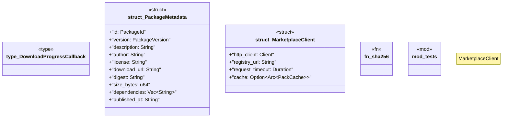

# `crates/ggen-marketplace/src/marketplace/network.rs`

Source SHA-256: `23946c76987efdb8820b0eb9085b3823a0aa6440080c388a6c7ad87d20d0a585`

## Dependencies

- `crate::marketplace::cache::PackCache`
- `crate::marketplace::error::{Error, Result}`
- `crate::marketplace::models::{PackageId, PackageVersion}`
- `reqwest::Client`
- `serde::{Deserialize, Serialize}`
- `sha2::{Digest, Sha256}`
- `std::sync::Arc`
- `std::time::Duration`
- `super::*`
- `tracing::{debug, info, instrument, span, warn}`

## Standing

- Structural parse: `ALIVE`
- Runtime behavior: `UNKNOWN`
