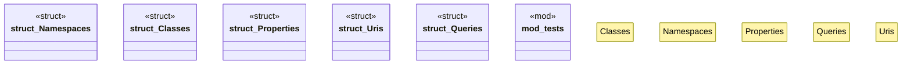

# `crates/ggen-marketplace/src/marketplace/ontology.rs`

Source SHA-256: `d30470f254473adc7be37ab82ea136dd5474eac5d34c908d79da56176b727f39`

## Dependencies

- `super::*`

## Standing

- Structural parse: `ALIVE`
- Runtime behavior: `UNKNOWN`
