# `crates/ggen-marketplace/src/marketplace/ownership.rs`

Source SHA-256: `73bc0a8d242c7b5482933464bcc29f59a59e7bdeb310b54b32a3f5398fbf1a3a`

```mermaid
classDiagram
    class struct_MergeResult {
      <<struct>>
      +"content: String"
      +"had_conflict: bool"
      +"description: String"
    }
    class enum_MergeError {
      <<enum>>
    }
    class enum_OwnershipClass {
      <<enum>>
    }
    class enum_OwnershipTarget {
      <<enum>>
    }
    class enum_MergeStrategy {
      <<enum>>
    }
    class fn_execute_merge_strategy {
      <<fn>>
    }
    class fn_merge_concat {
      <<fn>>
    }
    class fn_merge_last_writer_wins {
      <<fn>>
    }
    class fn_merge_first_writer_wins {
      <<fn>>
    }
    class fn_merge_recursive {
      <<fn>>
    }
    class fn_merge_semver {
      <<fn>>
    }
    class fn_merge_custom_sparql {
      <<fn>>
    }
    note "OwnershipClass"
    note "OwnershipTarget"
    note "std::error::Error for MergeError"
    note "std::fmt::Display for MergeError"
```

## Dependencies

- `semver`
- `serde::{Deserialize, Serialize}`
- `std::collections::HashMap`
- `std::path::PathBuf`
- `super::*`

## Standing

- Structural parse: `ALIVE`
- Runtime behavior: `UNKNOWN`
