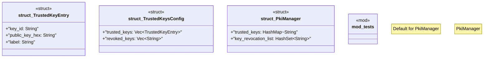

# `crates/ggen-marketplace/src/marketplace/pki.rs`

Source SHA-256: `bb6d53a2e3943551287a60813de2f7bcc904216362a7f69184f8d8bc85b8dde4`

## Dependencies

- `crate::marketplace::error::{Error, Result}`
- `ed25519_dalek::VerifyingKey`
- `ed25519_dalek::VerifyingKey as PublicKey`
- `serde::{Deserialize, Serialize}`
- `std::collections::{HashMap, HashSet}`
- `std::io::Write`
- `std::path::Path`
- `super::*`
- `tempfile::NamedTempFile`
- `tracing::{debug, instrument, warn}`

## Standing

- Structural parse: `ALIVE`
- Runtime behavior: `UNKNOWN`
