# `crates/ggen-marketplace/src/marketplace/policy.rs`

Source SHA-256: `aa37e2e002cfe8475694f392651f9380849e93160ffd0e05cfbb990a1c2a7f98`

```mermaid
classDiagram
    class struct_PolicyId {
      <<struct>>
    }
    class enum_PolicyRule {
      <<enum>>
    }
    class struct_Policy {
      <<struct>>
      +"id: PolicyId"
      +"name: String"
      +"description: String"
      +"rules: Vec~PolicyRule~"
      +"metadata: HashMap~String"
    }
    class struct_PolicyViolation {
      <<struct>>
      +"policy_id: PolicyId"
      +"rule: PolicyRule"
      +"pack_id: String"
      +"description: String"
      +"context: HashMap~String"
    }
    class struct_PolicyReport {
      <<struct>>
      +"passed: bool"
      +"violations: Vec~PolicyViolation~"
      +"policies_checked: Vec~PolicyId~"
    }
    class struct_PolicyEnforcer {
      <<struct>>
    }
    class struct_PackContext {
      <<struct>>
      +"id: String"
      +"has_template_defaults: bool"
      +"has_inferred_capabilities: bool"
      +"has_signed_receipts: bool"
      +"runtime: Option~String~"
      +"is_regulated_environment: bool"
      +"uses_public_registry: bool"
      +"trust_tier: TrustTier"
      +"ownership_classes: Vec~OwnershipClass~"
      +"is_allowlisted: bool"
      +"has_signature_verification: bool"
      +"uses_semver: bool"
      +"is_version_downgrade: bool"
      +"has_composition_receipt: bool"
      +"has_provenance_tracking: bool"
    }
    class mod_tests {
      <<mod>>
    }
    note "Default for PolicyEnforcer"
    note "From~String~ for PolicyId"
    note "PackContext"
    note "Policy"
    note "PolicyEnforcer"
    note "PolicyId"
    note "PolicyReport"
    note "PolicyRule"
    note "PolicyViolation"
    note "fmt::Display for PolicyId"
```

## Dependencies

- `crate::marketplace::error::{Error, Result}`
- `crate::marketplace::ownership::OwnershipClass`
- `crate::marketplace::trust::TrustTier`
- `serde::{Deserialize, Serialize}`
- `std::collections::HashMap`
- `std::fmt`
- `super::*`

## Standing

- Structural parse: `ALIVE`
- Runtime behavior: `UNKNOWN`
