# `crates/ggen-marketplace/src/marketplace/profile.rs`

Source SHA-256: `f1281e20660525bb3c47c45cd3b7c6410f95e18d1985cc76902d6fc28c417f33`

```mermaid
classDiagram
    class struct_ProfileId {
      <<struct>>
    }
    class enum_ReceiptSpec {
      <<enum>>
    }
    class struct_RuntimeConstraint {
      <<struct>>
      +"allowed_runtimes: Vec~String~"
      +"forbid_defaults: bool"
      +"require_explicit: bool"
      +"metadata: BTreeMap~String"
    }
    class struct_Profile {
      <<struct>>
      +"id: ProfileId"
      +"name: String"
      +"description: String"
      +"policy_overlays: Vec~Policy~"
      +"runtime_constraints: Vec~RuntimeConstraint~"
      +"trust_requirements: TrustTier"
      +"receipt_requirements: ReceiptSpec"
      +"metadata: BTreeMap~String"
    }
    class fn_enterprise_strict_profile {
      <<fn>>
    }
    class fn_regulated_finance_profile {
      <<fn>>
    }
    class fn_development_profile {
      <<fn>>
    }
    class fn_predefined_profiles {
      <<fn>>
    }
    class fn_get_profile {
      <<fn>>
    }
    class struct_CustomRuntimeConstraint {
      <<struct>>
      +"allowed_runtimes: Vec~String~"
      +"forbid_defaults: bool"
      +"require_explicit: bool"
    }
    class enum_CustomPolicyRef {
      <<enum>>
    }
    class struct_CustomProfileEntry {
      <<struct>>
      +"name: String"
      +"description: String"
      +"trust_tier: TrustTier"
      +"receipt_spec: ReceiptSpec"
      +"policies: Vec~CustomPolicyRef~"
      +"runtime_constraints: Vec~CustomRuntimeConstraint~"
      +"metadata: BTreeMap~String"
    }
    class struct_ProfileConfig {
      <<struct>>
      +"profiles: BTreeMap~String"
    }
    class struct_ProfileLoader {
      <<struct>>
    }
    class mod_tests {
      <<mod>>
    }
    note "CustomProfileEntry"
    note "Default for RuntimeConstraint"
    note "From~CustomPolicyRef~ for PolicyRule"
    note "From~CustomRuntimeConstraint~ for RuntimeConstraint"
    note "Profile"
    note "ProfileId"
    note "ProfileLoader"
    note "RuntimeConstraint"
```

## Dependencies

- `crate::marketplace::error::{Error, Result}`
- `crate::marketplace::policy::{PackContext, Policy, PolicyEnforcer, PolicyReport, PolicyRule}`
- `crate::marketplace::trust::TrustTier`
- `serde::{Deserialize, Serialize}`
- `std::collections::BTreeMap`
- `std::path::{Path, PathBuf}`
- `super::*`

## Standing

- Structural parse: `ALIVE`
- Runtime behavior: `UNKNOWN`
