# `crates/ggen-marketplace/src/marketplace/rdf/control.rs`

Source SHA-256: `70d793efcc7ac1355f8c34f3f37de8a0e5121483de8a3e5150e31908d2fcbfda`

```mermaid
classDiagram
    class struct_CacheStats {
      <<struct>>
      +"plan_cache_hits: u64"
      +"plan_cache_misses: u64"
      +"result_cache_hits: u64"
      +"result_cache_misses: u64"
      +"total_queries: u64"
      +"cache_size_bytes: u64"
      +"last_cleanup: Option~std::time::Instant~"
    }
    class struct_QueryHash {
      <<struct>>
      +"hash: u64"
      +"query_length: usize"
    }
    class type_ResultCache {
      <<type>>
    }
    class struct_CacheEntry {
      <<struct>>
      +"result: Vec~String~"
      +"timestamp: std::time::Instant"
      +"access_count: u32"
      +"size_bytes: usize"
    }
    class struct_QueryBatch {
      <<struct>>
      +"queries: Vec~String~"
      +"callback: Option~Box~dyn Fn(Vec~Vec~String~~) -~ Result~()~ + Send + Sync~~"
    }
    class struct_QueryPlanOptimizer {
      <<struct>>
      +"plan_cache: Arc~Mutex~LruCache~String"
    }
    class fn_execute_sparql_solutions {
      <<fn>>
    }
    class fn_extract_literal_from_solution {
      <<fn>>
    }
    class fn_opt_literal_from_solution {
      <<fn>>
    }
    class struct_RdfControlPlane {
      <<struct>>
      +"executor: Arc~SparqlExecutor~"
      +"state_machine: Arc~StateMachineExecutor~"
      +"config_loader: Arc~TurtleConfigLoader~"
      +"epoch: Arc~AtomicU64~"
      +"plan_cache: Arc~Mutex~LruCache~String"
      +"result_cache: ResultCache"
      +"batch_processor: Arc~Mutex~QueryBatch~~"
      +"query_optimizer: Arc~QueryPlanOptimizer~"
      +"cache_stats: Arc~Mutex~CacheStats~~"
      +"query_semaphore: Arc~tokio::sync::Semaphore~"
      +"common_queries: Arc~DashMap~String"
    }
    class struct_CachedPackage {
      <<struct>>
      +"name: String"
      +"description: String"
      +"version: PackageVersion"
      +"state: String"
      +"last_accessed: chrono::DateTime~chrono::Utc~"
    }
    class fn_get_dependencies {
      <<fn>>
    }
    class fn_validate_package {
      <<fn>>
    }
    class fn_get_maturity_metrics {
      <<fn>>
    }
    class fn_get_dashboard_stats {
      <<fn>>
    }
    class fn_executor {
      <<fn>>
    }
    class fn_state_machine {
      <<fn>>
    }
    class struct_SearchResult {
      <<struct>>
      +"package_id: PackageId"
      +"name: String"
      +"description: String"
      +"version: PackageVersion"
      +"quality_score: Option~QualityScore~"
      +"relevance: f64"
    }
    class struct_PackageListEntry {
      <<struct>>
      +"package_id: PackageId"
      +"name: String"
      +"version: PackageVersion"
      +"quality_score: Option~QualityScore~"
    }
    class struct_DependencyInfo {
      <<struct>>
      +"package_id: PackageId"
      +"version_requirement: String"
      +"is_optional: bool"
    }
    class struct_ValidationResult {
      <<struct>>
      +"package_id: PackageId"
      +"is_valid: bool"
      +"errors: Vec~String~"
    }
    class struct_MaturityMetrics {
      <<struct>>
      +"quality_score: Option~QualityScore~"
      +"download_count: u64"
      +"version_count: usize"
      +"last_update: Option~String~"
      +"test_coverage: Option~f64~"
      +"maturity_level: String"
    }
    class struct_DashboardStats {
      <<struct>>
      +"total_packages: usize"
      +"average_quality: f64"
      +"total_downloads: u64"
    }
    class mod_tests {
      <<mod>>
    }
    note "CacheEntry"
    note "Default for CacheStats"
    note "Hash for QueryHash"
    note "QueryBatch"
    note "QueryHash"
    note "QueryPlanOptimizer"
    note "RdfControlPlane"
```

## Dependencies

- `crate::marketplace::builders::PackageBuilder`
- `crate::marketplace::error::{Error, Result}`
- `crate::marketplace::models::{Package, PackageId, PackageVersion, QualityScore}`
- `crate::marketplace::ontology::MARKETPLACE_NS`
- `dashmap::DashMap`
- `indexmap::IndexMap`
- `lru::LruCache`
- `oxigraph::model::Term`
- `oxigraph::store::Store`
- `rayon::prelude::*`
- `std::hash::{Hash, Hasher}`
- `std::num::NonZeroUsize`
- `std::path::Path`
- `std::sync::{ atomic::{AtomicU64, Ordering}, Arc, Mutex, }`
- `std::time::Duration`
- `super::*`
- `super::sparql::SparqlExecutor`
- `super::state_machine::StateMachineExecutor`
- `super::turtle_config::TurtleConfigLoader`

## Standing

- Structural parse: `ALIVE`
- Runtime behavior: `UNKNOWN`
