# `crates/ggen-marketplace/src/marketplace/rdf/fmea_mitigations.rs`

Source SHA-256: `bcdc9e10fd677bed85cd8b1de9433ee3b5d306b4eb80e249f32c941815f127b8`

```mermaid
classDiagram
    class enum_FailureCategory {
      <<enum>>
    }
    class struct_FailureMode {
      <<struct>>
      +"id: &'static str"
      +"category: FailureCategory"
      +"description: &'static str"
      +"severity: u8"
      +"occurrence: u8"
      +"detection: u8"
      +"rpn: u16"
    }
    class struct_FmeaFailureModes {
      <<struct>>
    }
    class enum_MitigationResult {
      <<enum>>
    }
    class struct_FmeaMitigationManager {
      <<struct>>
      +"metrics: HashMap~&'static str"
      +"recovery_attempts: HashMap~&'static str"
    }
    class struct_FailureMetrics {
      <<struct>>
      +"occurrences: usize"
      +"last_occurrence: Option~Instant~"
      +"successful_recoveries: usize"
      +"failed_recoveries: usize"
      +"total_recovery_time: Duration"
    }
    class fn_has_no_references {
      <<fn>>
    }
    class fn_optimize_query {
      <<fn>>
    }
    class fn_load_backup_config {
      <<fn>>
    }
    class mod_tests {
      <<mod>>
    }
    note "Default for FmeaMitigationManager"
    note "FailureMode"
    note "FmeaFailureModes"
    note "FmeaMitigationManager"
```

## Dependencies

- `serde::{Deserialize, Serialize}`
- `std::collections::HashMap`
- `std::time::{Duration, Instant}`
- `super::*`
- `tracing::{error, info, warn}`

## Standing

- Structural parse: `ALIVE`
- Runtime behavior: `UNKNOWN`
