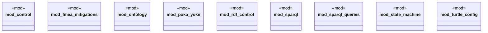

# `crates/ggen-marketplace/src/marketplace/rdf/mod.rs`

Source SHA-256: `a4d8190accd9a925d23b2f95de873131c44bb181396e537b3b53f3e120152741`

## Dependencies

- `control::RdfControlPlane`
- `fmea_mitigations::{FailureCategory, FailureMode, FmeaMitigationManager, MitigationResult}`
- `ontology::{generate_prefixes, namespaces}`
- `poka_yoke::{Literal, PokaYokeError, RdfGraph, ResourceId, Triple, ValidationConstraint}`
- `rdf_control::{ControlPlaneError, StateTransitionResult, ValidationResult}`
- `sparql::{SparqlExecutor, SparqlQuery, SparqlQueryBuilder}`
- `sparql_queries::{MarketplaceQueries, PackageSearchResult, SearchParams}`
- `state_machine::StateMachineExecutor`
- `turtle_config::TurtleConfigLoader`

## Standing

- Structural parse: `ALIVE`
- Runtime behavior: `UNKNOWN`
